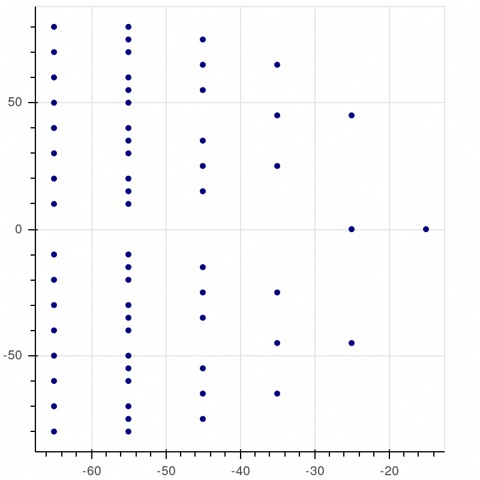
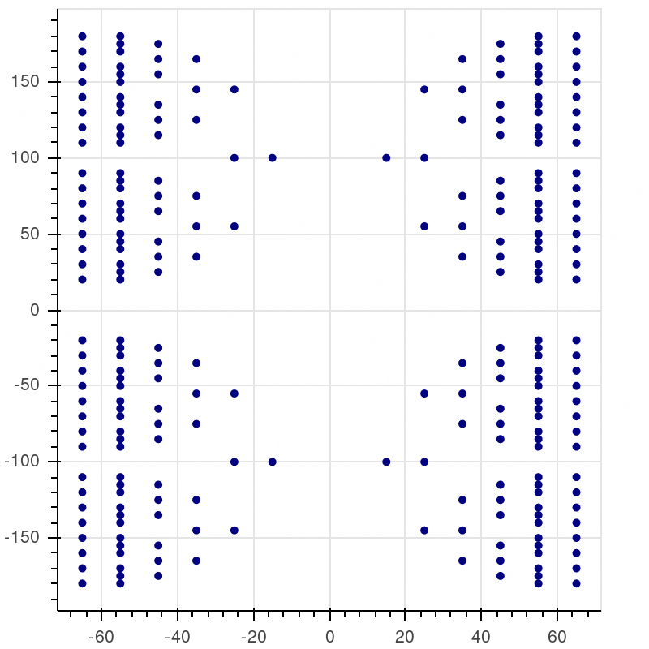
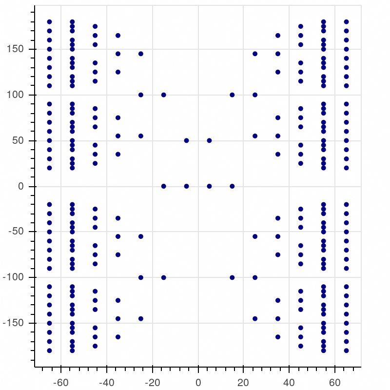
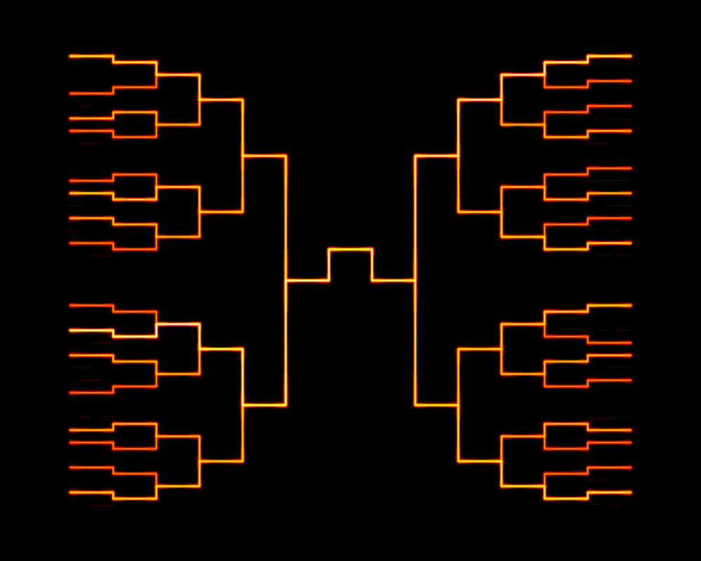
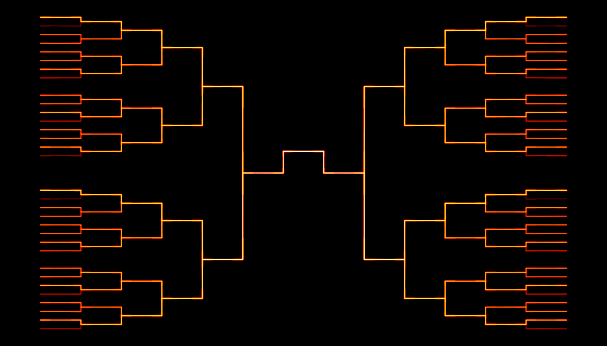
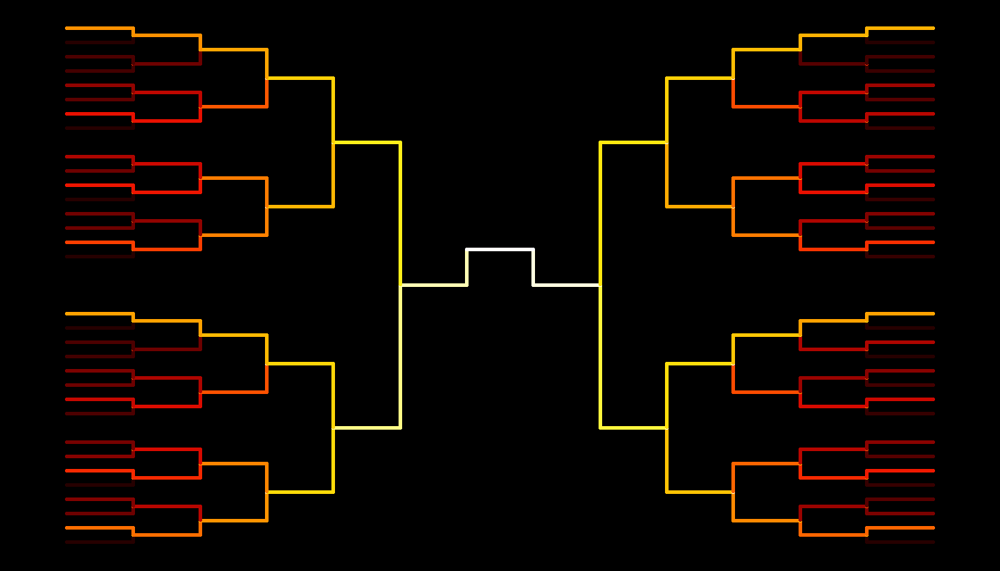

# NCAA Bracket History Visualization
Visual representation of all ncaa mens basketball turnament results. Designed for high-level visualization focused on seed and region position. Built using pandas, bokeh, and datashader. 

The result of this work is a ncaa mens basketball bracket built with data from all turnament resutls since 1985, excluding play-in games. The goal of this analysis was to create a bracket-based visualization of all turnament games which communicates how each region-seed position has performed over time. 

[bracket]: ./pics/1985-2017_final_4_and_champ_extra_lines.png "Bracket Visualization"

![Bracket Viz][bracket]

## Getting The Data
To start, I needed data. I got this from data world, uploaded by Michael Roy [https://data.world/michaelaroy/ncaa-tournament-results]. This was a great find, as I expected to have to put this in a similar format myself. Big thanks to Micheal Roy. I edited only a few of the column names to make them all unique. 

## Building the Bracket Verticies 
Next, I had to build the actual bracket verticies. I took the easy way out here and just built them by hand. I could have written some generation code, or even just imported verticies from a svg or something, but I just wrote them out by hand, there was lots of repeats so it was easy. I only needed to fill in one quarter of the bracket, and then just translate of reflect for the other three  groups of verticies.

After reflection and translation, I had all four quandrants of the bracket. The verticies here are the minimum number of points I needed to draw the bracket-shaped lines that will later make the figure. There needs to be 64 unique paths to the final four and the national championship.  

The last step here was to fill in the National Championship location. This took a little bit of thought as this is the non-standard part of the bracket. Brackets from different sources have many different style of illustrating the post-final-four part of the turnament, and most of them did not lend well to drawing a simple "foward only" line, which is what I wanted. Since I didn't see it right away, I asked someone for help, who immediately suggested the stucure I used. Also of note, is all quadrants share this component of the bracket, so it is not part of the reflection or translation. 

## Defining Unique Paths to Victory 
Alhtough not all probable, there are 64 possible unique paths to the National Championship, not including play-in games. So, Based on the verticies defined above, I put together a numpy darray of x and a matrix of y coordinates that defined the complete verticies by starting seed position for each region. After this, I stacked the regions together based on information from this article: [https://www.foxsports.com/college-basketball/story/ncaa-tournament-bracket-history-which-seeds-regions-brackets-have-most-winners-2017-teams-can-win-031517] by Chris Chase and meta data from the dataset sighted earlier by Michael Roy. This is the most shaky part of the whole analysis, as I tried for a while to figure out exactly how the regions work and was met with surprisingly little information. This part likely needs another look, but I only have so much time to make a goof turnament bracket. In the end I used the following relationship to the data that which showed the same features as described in Chris Chase's article. 

| Location on Bracket | Region Number Assigned in Data |
|---------------------|--------------------------------|
| Top Left     | 1 |
| Top Right    | 3 |
| Bottom Right | 4 |
| Bottom Left  | 2 |

I was expecting region number to mean region 1 winner plays region 4 winner and region 2 winner plays region 3 winner in the final four, but this did not look right. Also, there are changes in regions over time, and I'm not sure what all else. This is important as the wrong region placement make a big deal in the final message conveyed by the chart. But, this is the best I have right now.

I plotted all the paths to see how the bracket was looking. Below, its just lines drawn from begining to end without any consideration for wins or losses. 

## Drawing Victory Paths Dependent on Wins
Next, I devised a drawing scheme for the victory paths. After a little thought, I went with a multiplicatively increase number of identical vicotry paths for each single unqiue victory path based on how many wins the team in the given region-seed won. For example, if the overall number 1 seed (top left, region 1, seed 1) won against the 16 seed there, then the vicotry path for the 1 seed would extend 2 points, first travling down the y axis, then over on the x axis to the next bracket-landing in the next round. The 16 seed line would extend just 1 point, meeting the 1 seed line half way between the two seed lines on y axis. Additionally, instead of drawing 1 line, mutiplicativley more lines where drawn over the entire vicotry path based on number of games won. So in the above example, 10 lines were drawn over the 1 seed's path and just 1 over the 16 seeds path. Small differences in the x and y coordinates were added or subtracted from the verticies, giving a little bit of randomness to the paths. This process would extend as the team won more games agianst more teams, each time drawing 10 times more lines than numbers of games they won. Later this will create the "heating up" effect of particular region seeds winning more than others. 

Here result from the 1985 turnament, which incidently is a rather unqiue year, where Villanova won as the bottom left 8 seed playing against Georgetown, the 1 seed from the top right. 

I was not perfectly satisfied with the way this turned out, but forged forward anyway. 

The process used to make the figure above was looped over all turnaments to traslate the game results table into the victory paths to be plotted in the figure.

For All Years from 1985 to 2017:
* Subset the Turnament results by Year 
* Build a lookup table relating that year's teams to their unique region seed postion
* For All Teams in the 64 present for that turnament:
  * Find the maximum value of round reached for each team
  * If max round is 6 then:
    * Check if team 1 score > team 2 socre 
    * Assign a round value of 7 to winning team from round 6
  * Cacluate wins as round - 1
* Join number of wins column to lookup table
* Based on region seed, locate victory path x and y verticies matrix
* Based on number of wins, subset the x and y verticies marix
* Make copies of the selected x and y verticies with jitter defined by addition of a value from a standard t distribution
* Save all x and y verties to list 
* Exit loop 

Convert x and y verticies to pandas dataframe

## Plotting the Paths
Since the above process created a pandas dataframe that was ready to plot multiple lines based on the datashader library, all that remained was to define the canvas, plot features, and importantly the color map and heat map visualization method. I chose the fire color map (becuase its looks fancy) and the eq hist option for the heat map becuase it shows differences the way I was thinking. I messed around with these parameters a bit, and some more tuning could be done, but, time to move on to another project. To get the figure below, I went back and made a few changes: 
* Scaled the x and y points around to a more standard bracket shape
* Added a power increase to victory paths that made the final four (mutiplier^2) and championship (multiplier^3)
* Added hard cut-off to the jitter functions that create the heat map line effect to sharpen the edges.
* Set a minimum of 2 lines in the first round for teams that lost

**Here's the final result:**

## Closing Thoughts
This "burning bracket" shows how important it is to be a 1 or 2 seed if you really want to win the whole thing. There also are a few interesting features that pop out, including that over 30 turnaments all National Champs from the top right quadrant have been a 1 seed. A wider variety of seeds have won from the bottom quadrants than the top, and a wider variety of seeds have won in the bottom right quadrant than any other. How to use this data? Well, for example, if you choose to think of past turnaments as translating to probabilies of future results, than you probably want your team in the bottom half if you are not getting a one seed. Or, if you are having difficulty deciding which team to pick in a tough matchup, you could pick the "hotter" winner from this bracket.

There are a bunch of other things you could do with this plot and setup. As and Example, I turned off the line multiplier and drew only "true" paths, paths teams actually traced through all turnaments from 1985 to 2017. This way, I'm not forcing the map to show anything, but just looking at the data. Some of the same features can seen, but the winners and final fours are less obvious than in the first. I might tighten up this code, make it more modular if I find out the regions are definately correct, and make it easier to plot different analysis on the bracket. 

This true line bracket is capable of making unique assigments of region seed matchup winners based on greater number of lines, and could fill out a bracket. I'll try to do this and see how the "past dictates the future" assumption goes, we can think of it as a bench mark maybe.

**Only true paths, no multiples**

